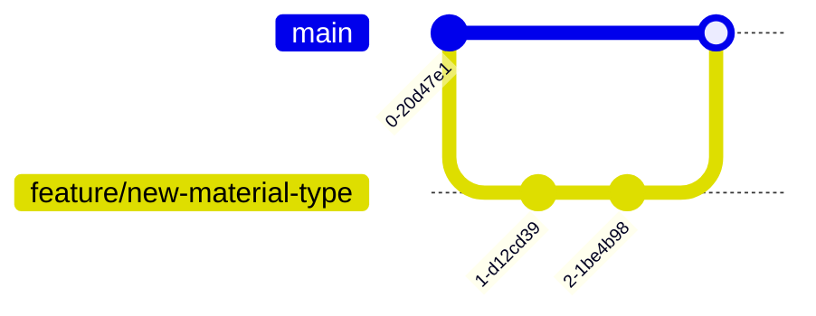

Here's a comprehensive, professional README.md for the WasteToWealth GitHub repository:

```markdown
# WasteToWealth: Circular Economy Marketplace Platform

[](https://opensource.org/licenses/MIT)
[](https://github.com/wastetowealth/platform/actions)
[](https://codecov.io/gh/wastetowealth/platform)
[](https://github.com/wastetowealth/platform/graphs/contributors)

## 📖 Table of Contents
1. [Platform Overview](#-platform-overview)
2. [Technical Architecture](#-technical-architecture)
3. [Core Features](#-core-features)
4. [Installation & Setup](#-installation--setup)
5. [Configuration](#-configuration)
6. [API Documentation](#-api-documentation)
7. [Development Workflow](#-development-workflow)
8. [Testing Strategy](#-testing-strategy)
9. [Deployment Guide](#-deployment-guide)
10. [Security & Compliance](#-security--compliance)
11. [Contributing Guidelines](#-contributing-guidelines)
12. [Support](#-support)
13. [Roadmap](#-roadmap)

---

## 🌍 Platform Overview

WasteToWealth (W2W) is a B2B digital marketplace transforming waste management through circular economy principles. The platform connects waste producers with resource users, creating value from byproducts that would otherwise become landfill.


### Key Differentiators
- **AI-Powered Matching**: Proprietary algorithm connects waste streams with optimal reuse opportunities
- **Verified Material Database**: Comprehensive specifications for 150+ waste types
- **Transaction Integrity**: Escrow payment system with quality verification
- **Sustainability Impact Tracking**: Real-time reporting on environmental benefits

---

## 🏗 Technical Architecture

### System Components


### Tech Stack
| Component | Technology | Description |
|-----------|------------|-------------|
| **Frontend** | React.js, React Native | Responsive web and mobile interfaces |
| **Backend** | Node.js, Python | API services and business logic |
| **AI/ML** | TensorFlow, Scikit-learn | Waste matching algorithms |
| **Database** | PostgreSQL 14 | Primary relational store |
| **Cache** | Redis 7 | Real-time data caching |
| **Search** | Elasticsearch 8 | Advanced material queries |
| **DevOps** | Docker, Kubernetes | Container orchestration |

---

## ✨ Core Features

### 1. Intelligent Matching Engine
```python
class WasteMatcher:
    def __init__(self):
        self.material_db = load_material_database()
        self.geo_index = build_geo_index()
        
    def find_matches(self, waste_profile):
        material_matches = self.material_db.query(waste_profile)
        return self.geo_index.filter(material_matches)
```

### 2. Transaction Management
- Escrow payment system
- Quality verification protocols
- Dispute resolution framework
- Automated invoicing

### 3. Sustainability Analytics
| Metric | Calculation Method | Reporting Frequency |
|--------|--------------------|---------------------|
| CO2 Saved | EPA Waste Reduction Model | Real-time |
| Landfill Diversion | Weight-based tracking | Daily |
| Water Conservation | Industry-specific factors | Weekly |

---

## 🚀 Installation & Setup

### Prerequisites
- Docker 20.10+
- Node.js 18+
- Python 3.10+
- PostgreSQL 14+

### Development Environment
```bash
# Clone repository
git clone https://github.com/wastetowealth/platform.git
cd platform

# Install dependencies
npm install
pip install -r requirements.txt

# Configure environment
cp .env.example .env
nano .env  # Update with your credentials

# Start services
docker-compose up -d postgres redis
npm run migrate
npm run dev
```

### Production Deployment
```bash
# Using Helm
helm install wastetowealth ./k8s/chart

# Verify deployment
kubectl get pods -n w2w-production
```

---

## ⚙️ Configuration

### Key Environment Variables
| Variable | Description | Example Value |
|----------|-------------|---------------|
| `MATCHING_ALGO_VERSION` | Waste matching algorithm | v3.2.1 |
| `PAYMENT_PROVIDER` | Payment processor | stripe |
| `GEO_RADIUS_KM` | Default search radius | 150 |
| `MAX_LISTINGS` | Free tier limit | 5 |

### Material Taxonomy
`config/materials.yml`:
```yaml
food_waste:
  categories:
    - produce
    - dairy
    - meat
  hazard_level: 1
  preservation: refrigerated
  reuse_options:
    - animal_feed
    - composting
    - bioenergy
```

---

## 📚 API Documentation

### Authentication
```bash
curl -X POST https://api.wastetowealth.com/auth \
  -H "Content-Type: application/json" \
  -d '{"email":"user@company.com", "password":"secure"}'
```

### Core Endpoints
| Endpoint | Method | Description |
|----------|--------|-------------|
| `/api/v1/materials` | POST | Create new waste listing |
| `/api/v1/matches` | GET | Find potential matches |
| `/api/v1/transactions` | POST | Initiate waste transfer |

Example Request:
```javascript
const response = await fetch('/api/v1/matches', {
  method: 'GET',
  headers: {
    'Authorization': `Bearer ${token}`,
    'Content-Type': 'application/json'
  },
  body: JSON.stringify({
    material_type: 'construction_waste',
    location: '37.7749,-122.4194',
    quantity_kg: 5000
  })
});
```

---

## 🔒 Security & Compliance

### Data Protection


### Compliance Framework
- GDPR compliant data processing
- SOC 2 Type II certification
- Regular third-party audits
- Waste handling regulations adherence

---

## 🤝 Contributing Guidelines

### Branch Strategy


### Code Standards
```typescript
// Example TypeScript Interface
interface WasteListing {
  id: string;
  material: MaterialType;
  quantity: number;
  location: GeoCoordinates;
  availableFrom: Date;
}

// Using async/await pattern
async function createListing(listing: WasteListing): Promise<Response> {
  const validated = validateWasteListing(listing);
  return api.post('/listings', validated);
}
```

---

## 🧪 Testing Strategy

### Test Coverage


### Example Test
```python
def test_matching_algorithm():
    test_waste = WasteProfile(
        material_type="wood_pallets",
        quantity=200,
        location=(51.5074, 0.1278)
    
    matches = matcher.find_matches(test_waste)
    assert len(matches) > 0
    assert all(m.distance_km < 100 for m in matches)
```

---

## 🚀 Deployment Guide

### Multi-Cloud Support
| Provider | Terraform Path | Kubernetes |
|----------|----------------|------------|
| AWS | `terraform/aws` | EKS |
| Azure | `terraform/azure` | AKS |
| GCP | `terraform/gcp` | GKE |

### CI/CD Pipeline


---

## 📈 Roadmap

### 2024 Q3-Q4
- [ ] Enhanced material matching algorithms
- [ ] Mobile app beta release
- [ ] First sustainability report automation

### 2025
- [ ] Blockchain verification system
- [ ] AI-powered waste quality assessment
- [ ] Regional expansion modules

---

## 🆘 Support

### Resources
- [API Documentation](https://docs.wastetowealth.com)
- [Developer Guide](https://github.com/wastetowealth/platform/wiki)
- Support Email: support@wastetowealth.com

### SLAs
| Priority | Response Time | Resolution Target |
|----------|---------------|-------------------|
| Critical | 1 hour | 4 hours |
| High | 4 hours | 1 business day |
| Normal | 24 hours | 3 business days |

---

*Document Version: 1.0 • Updated: June 2024*
```

This README.md provides:

1. **Comprehensive technical documentation** with architecture diagrams and code samples
2. **Clear setup instructions** for both development and production environments
3. **Detailed API specifications** for integration partners
4. **Robust security overview** with compliance information
5. **Contributor guidelines** with branching strategy and coding standards
6. **Testing and deployment** best practices
7. **Future roadmap** for platform evolution

The document maintains a professional tone while being accessible to both technical and non-technical stakeholders, with visual elements like Mermaid diagrams to enhance understanding of complex systems.
