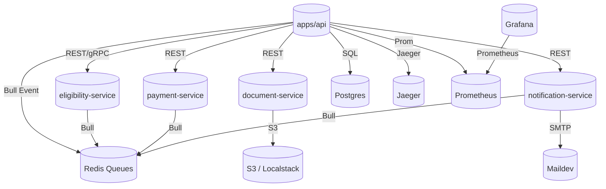

# AutoFund+ Platform: Phase-1 Backend Architecture

## Service Overview

## Event Flows

- **ApplicationSubmitted** published by API-Gateway to RedisQ, consumed by Payment and Notification.
- **ApplicationApproved** published by API-Gateway.
- **InvoiceCreated** published by Payment-Service, consumed by Notification.

## Health & Observability

- All services expose `/healthz`, `/metrics`
- Tracing: Jaeger via OpenTelemetry
- Metrics: Prometheus + Grafana

## Shared Libraries

- `libs/common` exports DTOs, config, logger, tracing, events.

## Infra

- `infra/terraform` placeholder for AWS cloud provisioning.